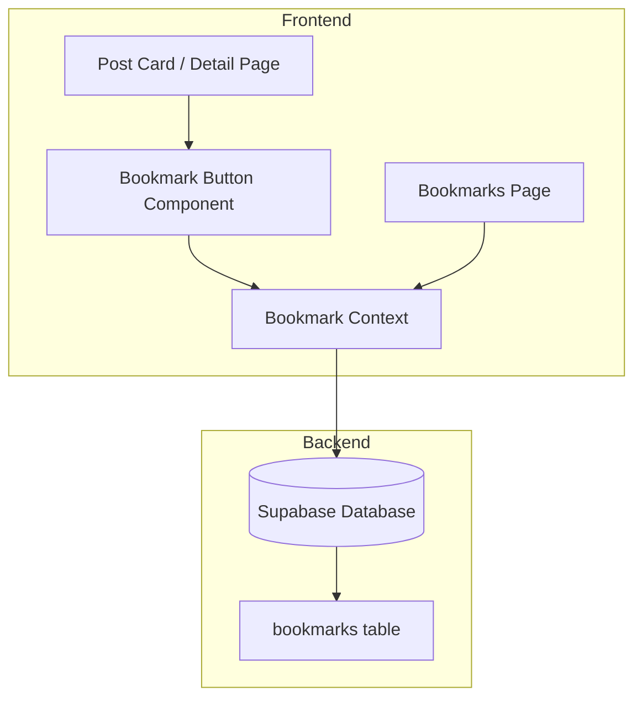

# Design Document: Bookmark System

## Overview

收藏系统允许用户保存感兴趣的文章。系统使用 Supabase 数据库存储收藏记录，通过 React Context 管理收藏状态，提供实时的 UI 反馈。

## Architecture



## Components and Interfaces

### 1. Database Schema

```sql
-- bookmarks 表
CREATE TABLE bookmarks (
  id SERIAL PRIMARY KEY,
  user_id UUID REFERENCES auth.users(id) ON DELETE CASCADE,
  post_id INTEGER REFERENCES posts(id) ON DELETE CASCADE,
  created_at TIMESTAMP WITH TIME ZONE DEFAULT NOW(),
  UNIQUE(user_id, post_id)
);

-- 索引优化查询
CREATE INDEX idx_bookmarks_user_id ON bookmarks(user_id);
CREATE INDEX idx_bookmarks_post_id ON bookmarks(post_id);
```

### 2. BookmarkButton Component

```typescript
interface BookmarkButtonProps {
  postId: number;
  initialBookmarked?: boolean;
  size?: 'sm' | 'md' | 'lg';
}

// 收藏按钮组件，显示收藏状态并处理点击事件
function BookmarkButton({ postId, initialBookmarked, size }: BookmarkButtonProps): JSX.Element
```

### 3. Bookmark Service Functions

```typescript
// 检查用户是否已收藏某文章
async function isBookmarked(userId: string, postId: number): Promise<boolean>

// 添加收藏
async function addBookmark(userId: string, postId: number): Promise<void>

// 移除收藏
async function removeBookmark(userId: string, postId: number): Promise<void>

// 切换收藏状态
async function toggleBookmark(userId: string, postId: number): Promise<boolean>

// 获取用户所有收藏
async function getUserBookmarks(userId: string): Promise<Post[]>

// 获取用户收藏数量
async function getBookmarkCount(userId: string): Promise<number>

// 批量检查收藏状态
async function getBookmarkStatuses(userId: string, postIds: number[]): Promise<Record<number, boolean>>
```

### 4. Bookmarks Page

新增 `/u/[id]/bookmarks` 页面，展示用户收藏的所有文章。

## Data Models

```typescript
interface Bookmark {
  id: number;
  user_id: string;
  post_id: number;
  created_at: string;
}

interface BookmarkWithPost extends Bookmark {
  posts: Post;
}
```

## Correctness Properties

*A property is a characteristic or behavior that should hold true across all valid executions of a system-essentially, a formal statement about what the system should do. Properties serve as the bridge between human-readable specifications and machine-verifiable correctness guarantees.*

### Property 1: Bookmark Round Trip

*For any* valid user and post combination, adding a bookmark then querying should return that the post is bookmarked.

**Validates: Requirements 1.1, 1.4**

### Property 2: Unbookmark Removes Record

*For any* bookmarked post, removing the bookmark then querying should return that the post is not bookmarked.

**Validates: Requirements 2.1, 2.2**

### Property 3: Bookmark List Contains All Bookmarks

*For any* set of bookmarked posts by a user, the bookmark list should contain exactly those posts.

**Validates: Requirements 3.1**

### Property 4: Bookmark List Order

*For any* set of bookmarks created at different times, the bookmark list should be ordered by creation time descending (newest first).

**Validates: Requirements 3.2**

### Property 5: Bookmark Icon State Matches Status

*For any* post and user, the bookmark icon should be filled if and only if the user has bookmarked that post.

**Validates: Requirements 4.1, 4.2**

## Error Handling

| Error Scenario | Handling Strategy |
|----------------|-------------------|
| 用户未登录 | 显示登录弹窗 |
| 网络错误 | 显示错误提示，保持原状态 |
| 重复收藏 | 数据库 UNIQUE 约束防止，前端乐观更新 |
| 文章已删除 | CASCADE 删除关联收藏 |

## Testing Strategy

### Unit Tests
- 测试 `toggleBookmark` 函数的状态切换逻辑
- 测试 `getBookmarkStatuses` 批量查询
- 测试边界情况（空列表、不存在的文章）

### Property-Based Tests
- 使用 fast-check 生成随机用户/文章组合
- 验证收藏/取消收藏的往返一致性
- 验证列表排序正确性

### Integration Tests
- 测试完整的收藏流程（UI → API → 数据库）
- 测试并发操作的正确性
