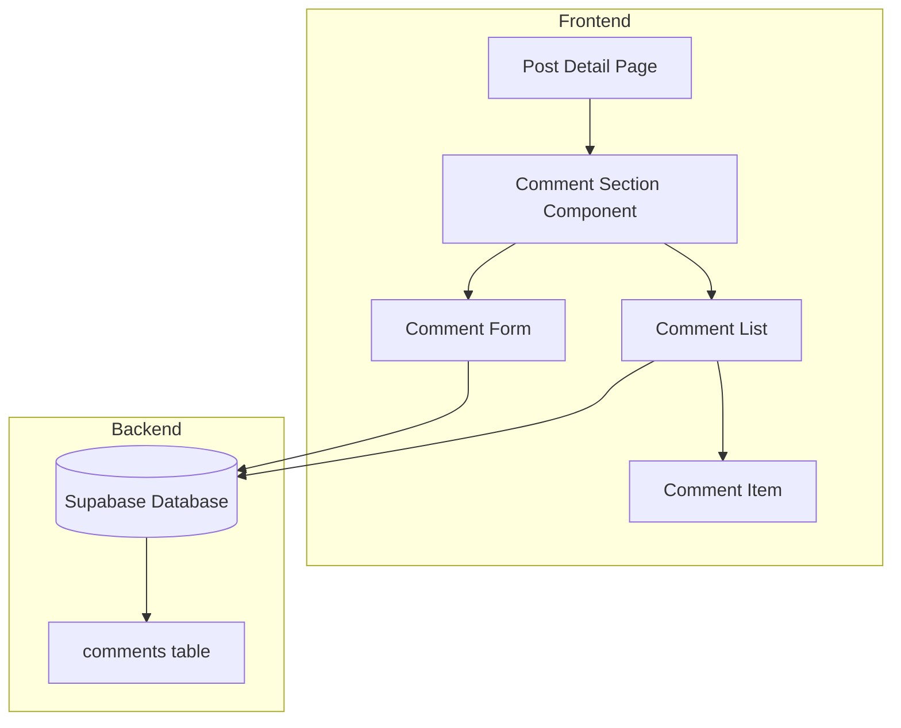

# Design Document: Comment System

## Overview

评论系统允许用户在文章下方发表评论和回复。使用 Supabase 存储评论数据，支持嵌套回复（最多2层）。

## Architecture



## Components and Interfaces

### 1. Database Schema

```sql
CREATE TABLE comments (
  id SERIAL PRIMARY KEY,
  post_id INTEGER NOT NULL REFERENCES posts(id) ON DELETE CASCADE,
  user_id UUID NOT NULL REFERENCES auth.users(id) ON DELETE CASCADE,
  parent_id INTEGER REFERENCES comments(id) ON DELETE CASCADE,
  content TEXT NOT NULL,
  created_at TIMESTAMP WITH TIME ZONE DEFAULT NOW(),
  updated_at TIMESTAMP WITH TIME ZONE DEFAULT NOW()
);

CREATE INDEX idx_comments_post_id ON comments(post_id);
CREATE INDEX idx_comments_parent_id ON comments(parent_id);
```

### 2. CommentSection Component

```typescript
interface CommentSectionProps {
  postId: number;
}

function CommentSection({ postId }: CommentSectionProps): JSX.Element
```

### 3. Comment Service Functions

```typescript
// 获取文章的所有评论
async function getComments(postId: number): Promise<Comment[]>

// 添加评论
async function addComment(postId: number, userId: string, content: string, parentId?: number): Promise<Comment>

// 删除评论
async function deleteComment(commentId: number, userId: string): Promise<void>

// 获取评论数量
async function getCommentCount(postId: number): Promise<number>
```

## Data Models

```typescript
interface Comment {
  id: number;
  post_id: number;
  user_id: string;
  parent_id: number | null;
  content: string;
  created_at: string;
  updated_at: string;
  // 关联数据
  profiles?: {
    username: string;
    avatar_url: string;
  };
  replies?: Comment[];
}
```

## Correctness Properties

*A property is a characteristic or behavior that should hold true across all valid executions of a system.*

### Property 1: Comment Persistence Round Trip

*For any* valid comment, adding it then querying should return that comment in the list.

**Validates: Requirements 1.1, 1.4**

### Property 2: Reply Nesting

*For any* reply, it should be linked to a parent comment and displayed nested under it.

**Validates: Requirements 2.1, 2.2**

### Property 3: Delete Cascades to Replies

*For any* parent comment with replies, deleting the parent should also remove all replies.

**Validates: Requirements 4.3**

## Error Handling

| Error Scenario | Handling Strategy |
|----------------|-------------------|
| 用户未登录 | 显示登录提示 |
| 评论内容为空 | 禁用提交按钮 |
| 网络错误 | 显示错误提示，保留输入内容 |
| 删除失败 | 显示错误提示 |

## Testing Strategy

### Unit Tests
- 测试评论添加逻辑
- 测试回复嵌套逻辑
- 测试删除级联

### Property-Based Tests
- 验证评论持久化
- 验证回复嵌套结构
