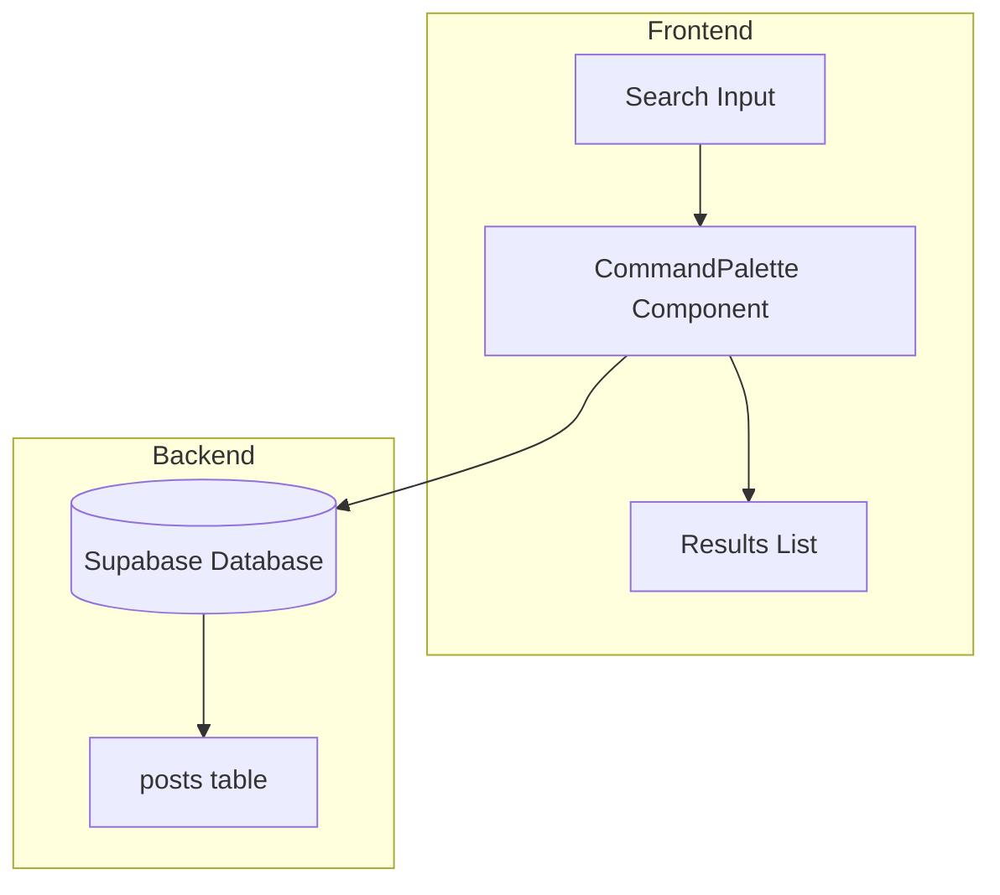

# Design Document: Enhanced Search

## Overview

增强 CommandPalette 组件，支持全文搜索（标题、内容、标签），并适配深色模式。

## Architecture



## Components and Interfaces

### 1. Enhanced Search Query

```typescript
// 搜索结果类型
interface SearchResult {
  type: 'post' | 'user';
  id: number | string;
  title: string;
  preview?: string;      // 内容预览
  tags?: string[];       // 匹配的标签
  matchField?: 'title' | 'content' | 'tags';  // 匹配字段
}

// 搜索函数
async function searchPosts(query: string): Promise<SearchResult[]>
```

### 2. Supabase Query

使用 Supabase 的 `or` 和 `ilike` 进行多字段搜索：

```typescript
const { data } = await supabase
  .from('posts')
  .select('id, title, content, tags')
  .or(`title.ilike.%${query}%,content.ilike.%${query}%,tags.cs.{${query}}`)
  .limit(10);
```

## Data Models

```typescript
interface Post {
  id: number;
  title: string;
  content: string;
  tags: string[];
  created_at: string;
}
```

## Correctness Properties

*A property is a characteristic or behavior that should hold true across all valid executions of a system.*

### Property 1: Search Results Relevance

*For any* search query, all returned results should contain the query string in at least one of: title, content, or tags.

**Validates: Requirements 1.1, 1.2, 1.3, 1.4**

### Property 2: Result Limit

*For any* search query, the number of returned results should not exceed 10.

**Validates: Requirements 2.4**

## Error Handling

| Error Scenario | Handling Strategy |
|----------------|-------------------|
| 空查询 | 不执行搜索，显示提示 |
| 网络错误 | 显示错误提示 |
| 无结果 | 显示"未找到结果"提示 |

## Testing Strategy

### Unit Tests
- 测试搜索结果过滤逻辑
- 测试结果数量限制

### Property-Based Tests
- 验证搜索结果相关性
- 验证结果数量限制
